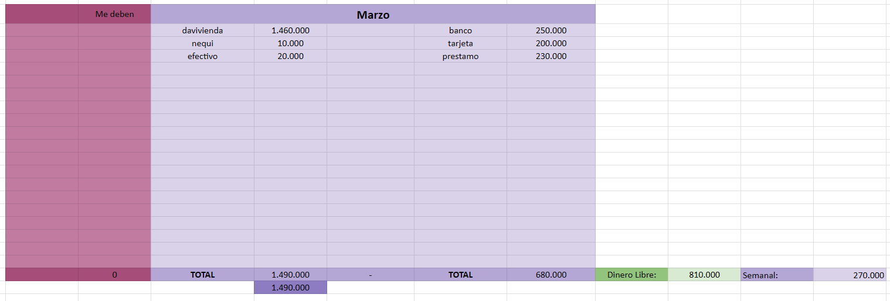
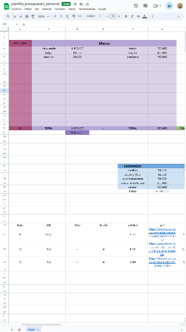
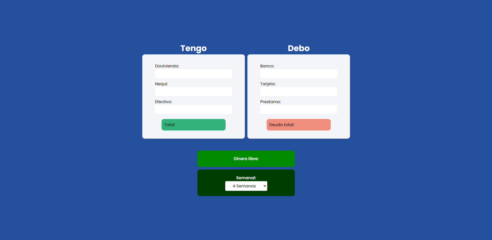
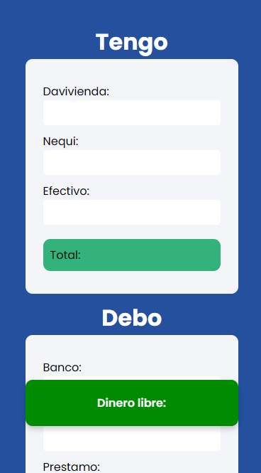
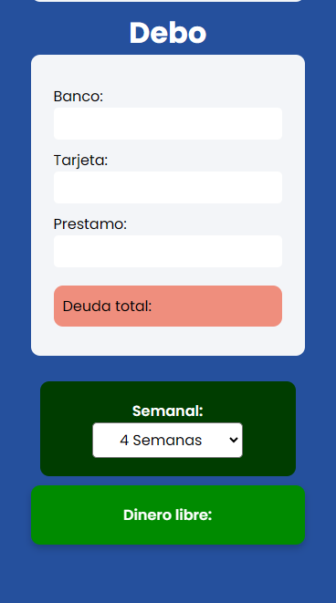

> [!TIP]
> Mira este proyecto: <a href="https://sakhurama.github.io/calculadoraGastos/">HAZ CLIC AQUÍ</a>

## Calculadora de Gastos
Antes de este proyecto llevaba mi control de gastos en Excel, pero esto tenía un problema,
no podía hacer las cuentas desde mi celular ya que la vista del documento era confusa e ilegible.

Así que elegí este proyecto de aprendizaje para reforzar mis conocimientos en Javascript, Html y CSS vanilla, 
mientras soluciono un problema de mi vida cotidiana.

### ¿Qué aprendí?
- Las funciones deberían cumplir un solo propósito, Sumar(), Restar(), Dividir()
- Formatear valores a tipo moneda con una función.
- Uso de condicionales y agregar clases CSS desde Javascript.
- Escuchar eventos.

### ¿Cosas por mejorar?
- Usar un HTML más semántico, evitar usar tantos div y usar section, main, footer...
- DRY - Dont Repeat Yourself

 
## ¡Echale un vistazo!
Así se veía el problema que tenía, aunque me funcionaba bien desde una computadora, en el celular era imposible hacer el control de mis gastos.
Existen aplicaciones que hacen esto pero te bombardean con anuncios o son muy complejas. Yo solamente quería un control de gastos básico, rápido y fácil de usar.

### Vista Excel

### Calculadora de Gastos
- Me permite hacer la división de mi dinero disponible por las semanas faltantes del mes.
- En vista mobile hay una burbuja flotante que me muestra el dinero disponible en cada momento.

### ¿Qué sigue?
Esto no acaba acá aún tengo algunas ideas y nuevos features para este proyectito tan divertido y útil.

- Cuando dinero puedo gastar al día según mi dinero disponible.
- Agregar campos con nombre propio, tal vez alguien no usa Davivienda sino Bancolombia.
- ...
